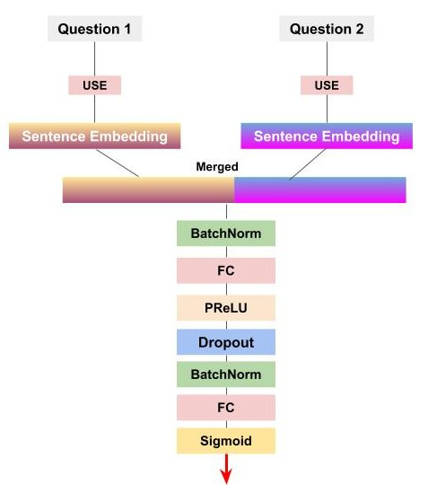

<h1 align="center">
  
  Quora Question Pairs 

</h1>

 

    <strong>🏆&nbsp; Can you identify question pairs that have the same intent?</strong>

- [Competition link](https://www.kaggle.com/c/quora-question-pairs)

----

## Architecture

  

- `USE`: Universal Sentence Encoder
- Validation Accuracy: `84%` 

----
